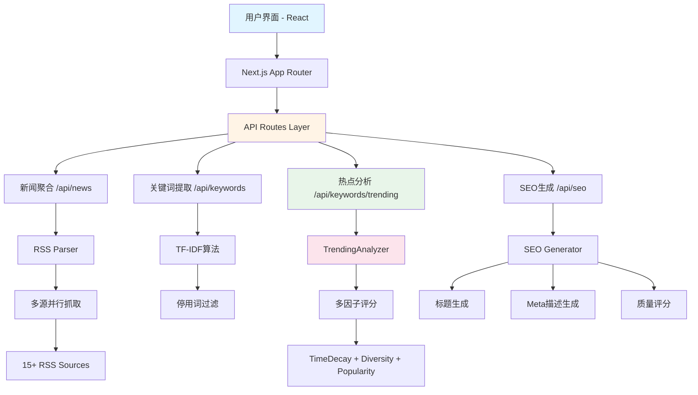

# 📰 News SEO Assistant

> 智能新闻聚合、热点关键词分析与SEO优化助手

[](https://nextjs.org/)
[](https://www.typescriptlang.org/)
[](https://tailwindcss.com/)
[](LICENSE)

一个功能完整的新闻聚合和SEO优化工具，支持多地区RSS源订阅、智能关键词提取、热点趋势分析和SEO内容生成，帮助内容创作者快速捕捉热点并优化内容。

**🌐 在线演示**: [Demo Link](https://your-demo-link.vercel.app)

---

## ✨ 核心功能

### 📡 **新闻聚合系统**
- 🌏 **多地区支持**: 新加坡、上海、香港三地新闻源
- 📰 **多源并行抓取**: BBC、TechCrunch、新浪、网易、搜狐、SCMP等15+RSS源
- 🔄 **实时更新**: 60分钟缓存策略，确保新闻时效性
- 🎯 **地区筛选**: 一键切换不同地区新闻内容

### 🔥 **热点关键词推荐** (NEW)
- 📊 **智能评分算法**:
  - **TF-IDF基础**: 词频-逆文档频率计算
  - **时间衰减**: 指数衰减模型 (e^(-0.01 × 小时))
  - **地域多样性**: 跨区域出现加成 (+50%)
  - **热度加权**: 对数新闻数量缩放
- 🕐 **24小时热点**: 基于最近24小时新闻动态分析
- 📈 **趋势追踪**: 实时显示关键词出现频率、地区分布、新闻源统计
- 💾 **数据导出**: JSON/CSV格式导出，支持Excel中文显示

### 🔍 **关键词提取器**
- 🧠 **TF-IDF算法**: 自动识别文本重要关键词
- 🌐 **双语支持**: 中文/英文停用词过滤
- 📊 **多维可视化**:
  - 📋 列表视图：关键词 + TF-IDF评分
  - ☁️ 词云图：视觉化关键词权重
  - 📈 图表视图：TF-IDF评分柱状图
- 🎨 **Tab界面**: 热点推荐 vs 自定义分析清晰分离

### ✍️ **SEO内容助手**
- 🎯 **智能标题生成**: 3组SEO优化标题建议（50-60字符）
- 📝 **Meta描述生成**: 3组描述建议（150-160字符）
- 🏆 **质量评分系统**: 0-100分评分，实时质量反馈
- 🔤 **关键词自然植入**: 优先使用Top 3关键词

### 🌍 **国际化系统**
- 🇬🇧 **English**: 完整英文界面支持
- 🇨🇳 **简体中文**: 完整中文界面支持
- 🔄 **一键切换**: 右上角语言切换器

### 🎨 **现代化UI/UX**
- 📱 **响应式设计**: 完美适配桌面/平板/手机
- 🌓 **暗黑模式支持**: 自动/手动切换主题
- ⚡ **流畅动画**: Tailwind CSS动画效果
- 🎯 **直观交互**: 实时反馈、加载状态、错误提示

---

## 🛠️ 技术栈

### 核心框架
| 技术 | 版本 | 用途 |
|------|------|------|
| **Next.js** | 16.0.1 | React全栈框架（App Router） |
| **React** | 18+ | UI组件库 |
| **TypeScript** | 5.4+ | 类型安全开发 |
| **Tailwind CSS** | 4.0 | 原子化CSS框架 |

### 状态管理与数据
| 技术 | 版本 | 用途 |
|------|------|------|
| **Zustand** | 4.5+ | 轻量级状态管理 |
| **React Query** | 5.59+ | 服务端状态管理、缓存 |
| **date-fns** | 4.1+ | 日期时间处理 |

### NLP与数据处理
| 技术 | 版本 | 用途 |
|------|------|------|
| **natural.js** | 7.0+ | TF-IDF算法、NLP处理 |
| **rss-parser** | 3.13+ | RSS feed解析 |

### UI组件库
| 技术 | 版本 | 用途 |
|------|------|------|
| **Radix UI** | 1.0+ | 无障碍UI组件基础 |
| **Lucide React** | 0.468+ | 图标库 |
| **Recharts** | 2.14+ | 数据可视化 |

### AI集成 (可选)
| 技术 | 版本 | 用途 |
|------|------|------|
| **OpenAI SDK** | 4.73+ | GPT-4模型调用 |
| **AI SDK** | 4.0+ | AI功能封装 |

---

## 📁 项目架构

```
news-seo-assistant/
├── 📂 app/                          # Next.js App Router
│   ├── 📂 api/                      # API路由层
│   │   ├── 📂 news/                 # 新闻聚合API
│   │   │   └── route.ts             # GET /api/news?region=all
│   │   ├── 📂 keywords/             # 关键词API
│   │   │   ├── route.ts             # POST /api/keywords
│   │   │   └── 📂 trending/         # 热点关键词API
│   │   │       └── route.ts         # GET /api/keywords/trending
│   │   └── 📂 seo/                  # SEO生成API
│   │       ├── route.ts             # POST /api/seo
│   │       └── 📂 ai/               # AI增强SEO (可选)
│   │           └── route.ts         # POST /api/seo/ai
│   ├── page.tsx                     # 首页 (新闻聚合)
│   ├── 📂 keywords/                 # 关键词分析页
│   │   └── page.tsx                 # /keywords
│   ├── 📂 seo/                      # SEO助手页
│   │   └── page.tsx                 # /seo
│   └── layout.tsx                   # 根布局
│
├── 📂 lib/                          # 核心业务逻辑
│   ├── 📂 rss/                      # RSS处理
│   │   ├── parser.ts                # RSS解析、多源并行抓取
│   │   └── cache.ts                 # RSS缓存管理
│   ├── 📂 nlp/                      # NLP处理
│   │   ├── tfidf.ts                 # TF-IDF算法实现
│   │   ├── trending-analyzer.ts    # 热点关键词分析器 ⭐
│   │   └── stopwords.ts             # 中英文停用词
│   ├── 📂 seo/                      # SEO生成
│   │   ├── generator.ts             # SEO内容生成器
│   │   └── scorer.ts                # 质量评分系统
│   ├── 📂 export/                   # 数据导出 ⭐
│   │   └── exporters.ts             # JSON/CSV导出工具
│   ├── 📂 regions/                  # 地区管理 ⭐
│   │   └── utils.ts                 # 地区工具函数
│   ├── 📂 i18n/                     # 国际化
│   │   ├── context.tsx              # i18n Context
│   │   └── 📂 locales/              # 语言包
│   │       ├── en.ts                # 英文
│   │       └── zh.ts                # 中文
│   ├── 📂 ai/                       # AI功能 (可选)
│   │   ├── 📂 services/             # AI服务
│   │   ├── 📂 prompts/              # Prompt模板
│   │   └── 📂 utils/                # AI工具函数
│   └── utils.ts                     # 通用工具函数
│
├── 📂 components/                   # React组件
│   ├── 📂 ui/                       # 基础UI组件
│   │   ├── button.tsx               # 按钮
│   │   ├── card.tsx                 # 卡片
│   │   ├── badge.tsx                # 徽章
│   │   ├── tabs.tsx                 # Tab导航 ⭐
│   │   └── ...                      # 其他UI组件
│   ├── 📂 news/                     # 新闻相关组件
│   │   ├── NewsCard.tsx             # 新闻卡片
│   │   └── NewsList.tsx             # 新闻列表
│   ├── 📂 keywords/                 # 关键词组件 ⭐
│   │   └── TrendingKeywordsList.tsx # 热点关键词列表
│   ├── 📂 ai/                       # AI组件
│   │   └── KeywordClusterView.tsx   # 关键词聚类视图
│   ├── KeywordCloud.tsx             # 词云图
│   ├── KeywordChart.tsx             # 图表视图
│   ├── Breadcrumb.tsx               # 面包屑导航
│   └── LanguageSwitcher.tsx         # 语言切换器
│
├── 📂 store/                        # 状态管理
│   └── useNewsStore.ts              # Zustand全局状态
│
├── 📂 types/                        # TypeScript类型定义
│   └── index.ts                     # 核心类型 (NewsItem, Keyword, TrendingKeyword, etc.)
│
├── 📂 config/                       # 配置文件
│   ├── rss-sources.json             # RSS源配置
│   └── regions-metadata.json        # 地区元数据 ⭐
│
├── 📂 scripts/                      # 工具脚本 ⭐
│   └── test-rss-sources.js          # RSS源测试脚本
│
├── 📂 claudedocs/                   # 开发文档
│   ├── Region-Expansion-Phase1-HongKong.md
│   └── Trending-Keywords-Implementation.md
│
├── .env.local                       # 环境变量
├── next.config.ts                   # Next.js配置
├── tailwind.config.ts               # Tailwind配置
├── tsconfig.json                    # TypeScript配置
└── package.json                     # 项目依赖

⭐ = 最新功能
```

---

## 🚀 快速开始

### 📋 前置要求

- **Node.js**: >= 18.0.0
- **npm/pnpm/yarn**: 任意包管理器
- **Git**: 版本控制

### 📦 1. 克隆项目

```bash
# HTTPS
git clone https://github.com/Youhai020616/new-seo.git

# SSH
git clone git@github.com:Youhai020616/new-seo.git

# 进入项目目录
cd news-seo-assistant
```

### ⚙️ 2. 安装依赖

```bash
# 使用 npm
npm install

# 或使用 pnpm (推荐，更快)
pnpm install

# 或使用 yarn
yarn install
```

### 🔐 3. 环境配置

创建 `.env.local` 文件：

```bash
# 应用配置
NEXT_PUBLIC_APP_URL=http://localhost:3000
NEXT_PUBLIC_APP_NAME="News SEO Assistant"

# RSS缓存时长（分钟）
RSS_CACHE_DURATION=60

# [可选] OpenAI API配置 (用于AI增强功能)
OPENAI_API_KEY=sk-your-api-key-here
OPENAI_MODEL=gpt-4-turbo-preview
```

### 🚀 4. 启动开发服务器

```bash
# 开发模式（热更新）
npm run dev

# 或
pnpm dev

# 或
yarn dev
```

访问 **http://localhost:3000** 🎉

### 🏗️ 5. 生产构建

```bash
# 构建生产版本
npm run build

# 启动生产服务器
npm start

# 或一键构建+启动
npm run build && npm start
```

### 🧪 6. 代码质量检查

```bash
# TypeScript类型检查
npx tsc --noEmit

# ESLint代码检查
npm run lint

# 格式化代码 (如果配置了Prettier)
npm run format
```

---

## 💻 使用指南

### 📰 新闻聚合
1. 打开首页 `http://localhost:3000`
2. 默认显示所有地区新闻
3. 点击地区按钮切换：🇸🇬 新加坡 | 🇨🇳 上海 | 🇭🇰 香港
4. 点击"🔍 分析"按钮提取单篇新闻关键词

### 🔥 热点关键词
1. 访问 `/keywords` 页面
2. 切换到"🔥 热点推荐" Tab
3. 查看基于24小时新闻的热点关键词排行
4. 点击"刷新"按钮更新数据
5. 导出数据：点击"JSON"或"CSV"按钮

### ✍️ 自定义关键词分析
1. 在 `/keywords` 页面，切换到"✍️ 自定义分析" Tab
2. 粘贴文本内容到输入框
3. 点击"🔍 提取关键词"按钮
4. 切换视图：📋 列表 | ☁️ 词云 | 📊 图表
5. 查看详细分析表格

### ✨ SEO优化
1. 从关键词页面点击"生成SEO建议"跳转
2. 或直接访问 `/seo` 页面
3. 输入目标关键词（逗号分隔）
4. （可选）添加内容摘要
5. 点击"生成SEO"
6. 复制推荐的标题和描述

---

## 🔌 API文档

### 📡 新闻API

#### 获取新闻列表
```http
GET /api/news?region={region}
```

**Query参数**:
- `region` (可选): `singapore` | `shanghai` | `hongkong` | `all` (默认: `all`)

**响应示例**:
```json
{
  "success": true,
  "news": [
    {
      "id": "unique-id",
      "title": "新闻标题",
      "summary": "新闻摘要...",
      "link": "https://example.com/article",
      "source": "BBC News",
      "region": "singapore",
      "publishDate": "2025-01-07T10:00:00Z"
    }
  ],
  "total": 50
}
```

---

### 🔍 关键词API

#### 提取关键词（TF-IDF）
```http
POST /api/keywords
Content-Type: application/json

{
  "texts": ["文本内容1", "文本内容2"]
}
```

**响应示例**:
```json
{
  "success": true,
  "keywords": [
    {
      "word": "人工智能",
      "frequency": 5,
      "tfidf": 0.8234
    }
  ]
}
```

#### 获取热点关键词 ⭐
```http
GET /api/keywords/trending?region={region}&limit={limit}&hours={hours}
```

**Query参数**:
- `region` (可选): 地区筛选，默认 `all`
- `limit` (可选): 返回数量，默认 `20`，最大 `50`
- `hours` (可选): 时间范围（小时），默认 `24`

**响应示例**:
```json
{
  "success": true,
  "keywords": [
    {
      "word": "ChatGPT",
      "rank": 1,
      "trendingScore": 8.76,
      "frequency": 12,
      "tfidf": 0.923,
      "newsCount": 8,
      "regions": ["singapore", "shanghai"],
      "sources": ["BBC", "TechCrunch"],
      "firstSeen": "2025-01-07T08:00:00Z",
      "lastSeen": "2025-01-07T14:30:00Z",
      "avgAge": 6.5,
      "relatedNews": [...]
    }
  ],
  "metadata": {
    "totalNews": 120,
    "analyzedRegions": ["singapore", "shanghai", "hongkong"],
    "timeRange": {
      "from": "2025-01-06T14:30:00Z",
      "to": "2025-01-07T14:30:00Z"
    },
    "generatedAt": "2025-01-07T14:30:00Z"
  }
}
```

---

### ✍️ SEO API

#### 生成SEO建议
```http
POST /api/seo
Content-Type: application/json

{
  "keywords": [
    { "word": "AI", "tfidf": 0.8 },
    { "word": "技术", "tfidf": 0.6 }
  ],
  "summary": "关于AI技术的文章..."
}
```

**响应示例**:
```json
{
  "success": true,
  "titles": [
    { "text": "AI技术革新：探索未来智能化发展", "score": 85 },
    { "text": "技术前沿：AI如何改变世界", "score": 82 }
  ],
  "metaDescriptions": [
    {
      "text": "深入探讨AI技术的最新发展...",
      "score": 88
    }
  ]
}
```

#### AI增强SEO（可选）
```http
POST /api/seo/ai
Content-Type: application/json

{
  "keywords": ["AI", "机器学习"],
  "summary": "文章摘要...",
  "language": "zh"
}
```

---

## 🏗️ 系统架构

### 数据流架构



### 热点关键词评分算法

```
TrendingScore = BaseScore × TimeDecay × DiversityBonus × PopularityFactor

其中：
- BaseScore: 归一化TF-IDF分数 (0-1)
- TimeDecay: e^(-λ × ageHours), λ = 0.01
- DiversityBonus: 1 + (uniqueRegions / totalRegions) × 0.5
- PopularityFactor: log(1 + newsCount)

最终分数范围: 0-10
```

### RSS聚合策略

```javascript
// 并行抓取多个RSS源
const results = await Promise.allSettled(
  sources.map(source =>
    fetchRSS(source.url, { timeout: 10000 })
  )
);

// 容错处理：忽略失败源
const validResults = results
  .filter(r => r.status === 'fulfilled')
  .map(r => r.value);

// 按时间排序
const sortedNews = validResults
  .flat()
  .sort((a, b) =>
    new Date(b.publishDate) - new Date(a.publishDate)
  );
```

---

## 🧪 核心算法详解

### TF-IDF算法

**Term Frequency - Inverse Document Frequency**

```
TF-IDF = TF(t, d) × IDF(t, D)

TF(t, d) = count(t in d) / total_words(d)
IDF(t, D) = log(N / DF(t))

其中：
- t: 词项
- d: 文档
- D: 文档集合
- N: 文档总数
- DF(t): 包含词项t的文档数
```

**优势**:
- ✅ 自动识别重要词汇
- ✅ 降低高频常用词权重
- ✅ 适合中英文混合场景

### 停用词过滤

**中文停用词** (部分示例):
```javascript
['的', '了', '在', '是', '我', '有', '和', '就', ...]
```

**英文停用词** (部分示例):
```javascript
['the', 'a', 'an', 'is', 'are', 'was', 'were', ...]
```

---

## 📊 性能指标

| 指标 | 实际值 | 说明 |
|------|--------|------|
| 🌐 RSS聚合 | ~3秒 | 并行抓取15+源 |
| 🔍 关键词提取 | ~0.5秒 | TF-IDF计算 |
| 🔥 热点分析 | ~2秒 | 24小时新闻分析 |
| ✍️ SEO生成 | ~200ms | 规则引擎生成 |
| 🎨 首屏加载 | ~1.5秒 | SSR + RSC优化 |
| 💾 导出数据 | ~100ms | 客户端生成 |

**优化策略**:
- ⚡ **RSS缓存**: 60分钟内存缓存
- 🚀 **并行处理**: Promise.allSettled并发
- 📦 **代码分割**: Next.js动态导入
- 🎯 **SSR/SSG**: 关键页面预渲染

---

## 🔧 配置文件

### RSS源配置 (`config/rss-sources.json`)

```json
{
  "sources": [
    {
      "name": "BBC News",
      "url": "http://feeds.bbci.co.uk/news/rss.xml",
      "region": "singapore",
      "language": "en"
    },
    {
      "name": "新浪新闻",
      "url": "https://news.sina.com.cn/rss/world.xml",
      "region": "shanghai",
      "language": "zh"
    }
  ]
}
```

### 地区元数据 (`config/regions-metadata.json`)

```json
{
  "regions": [
    {
      "id": "singapore",
      "nameEn": "Singapore",
      "nameZh": "新加坡",
      "timezone": "Asia/Singapore",
      "languages": ["en", "zh"],
      "flag": "🇸🇬",
      "enabled": true,
      "order": 1
    }
  ]
}
```

---

## 🧪 测试

### RSS源测试

```bash
# 测试所有RSS源
node scripts/test-rss-sources.js

# 测试特定地区
node scripts/test-rss-sources.js singapore
node scripts/test-rss-sources.js shanghai
node scripts/test-rss-sources.js hongkong
```

**输出示例**:
```
✅ BBC News (Singapore): 50 articles
✅ TechCrunch (Singapore): 42 articles
❌ Example Source (Singapore): Failed to fetch
```

---

## 📈 数据导出

### JSON格式

```json
{
  "exportDate": "2025-01-07T14:30:00Z",
  "version": "1.0",
  "dataType": "trending-keywords",
  "metadata": {
    "totalNews": 120,
    "analyzedRegions": ["singapore", "shanghai", "hongkong"]
  },
  "trendingKeywords": [...]
}
```

### CSV格式

```csv
排名,关键词,热度评分,出现频率,TF-IDF分数,新闻数量,地区,新闻源,首次出现,最后出现,平均年龄(小时)
1,ChatGPT,8.76,12,0.9230,8,"singapore, shanghai","BBC, TechCrunch",2025-01-07 08:00,2025-01-07 14:30,6.5
```

**特点**:
- ✅ UTF-8 BOM编码（Excel中文显示正常）
- ✅ 自动转义逗号、引号
- ✅ 时间格式：YYYY-MM-DD HH:MM

---

## 🌍 国际化支持

### 支持语言

| 语言 | 代码 | 完成度 |
|------|------|--------|
| 🇬🇧 English | `en` | 100% |
| 🇨🇳 简体中文 | `zh` | 100% |

### 添加新语言

1. 创建语言文件 `lib/i18n/locales/ja.ts`
2. 复制 `en.ts` 结构
3. 翻译所有文本
4. 在 `lib/i18n/context.tsx` 中注册

```typescript
export const ja: TranslationKeys = {
  nav: {
    news: 'ニュース',
    keywords: 'キーワード',
    seo: 'SEOアシスタント',
  },
  // ...
};
```

---

## 🔮 功能路线图

### ✅ 已完成
- [x] 新闻RSS聚合（新加坡、上海、香港）
- [x] TF-IDF关键词提取
- [x] 热点关键词推荐系统
- [x] SEO标题和描述生成
- [x] JSON/CSV数据导出
- [x] Tab导航界面优化
- [x] 中英文国际化
- [x] 响应式设计

### 🚧 进行中
- [ ] 关键词历史趋势图表
- [ ] 热点关键词相关新闻详情页
- [ ] 用户收藏/书签功能

### 🔮 计划中
- [ ] Tokyo和Seoul地区支持 (Phase 2)
- [ ] 关键词聚类可视化增强
- [ ] 社交媒体分享功能
- [ ] PDF报告导出
- [ ] 定时任务：每日热点关键词邮件
- [ ] WebSocket实时新闻推送
- [ ] 用户认证系统
- [ ] 多账户管理

---

## 🤝 贡献指南

欢迎贡献！请遵循以下步骤：

1. **Fork本仓库**
2. **创建特性分支**: `git checkout -b feature/AmazingFeature`
3. **提交更改**: `git commit -m 'feat: add AmazingFeature'`
4. **推送到分支**: `git push origin feature/AmazingFeature`
5. **提交Pull Request**

### 提交规范

遵循 [Conventional Commits](https://www.conventionalcommits.org/):

```
feat: 新功能
fix: 修复bug
docs: 文档更新
style: 代码格式调整
refactor: 重构
perf: 性能优化
test: 测试
chore: 构建/工具链
```

---

## 📄 开源协议

本项目采用 **MIT License** 开源协议。

详见 [LICENSE](LICENSE) 文件。

---

## 🙏 致谢

### 核心依赖
- [Next.js](https://nextjs.org/) - The React Framework
- [Natural](https://github.com/NaturalNode/natural) - NLP Library
- [Radix UI](https://www.radix-ui.com/) - Accessible Components
- [Tailwind CSS](https://tailwindcss.com/) - Utility-first CSS

### RSS源提供方
- BBC News, TechCrunch, 新浪新闻, 网易新闻, 搜狐新闻
- South China Morning Post, Hong Kong Free Press, The Standard HK

---

## 📞 联系方式

- **Author**: Youhai
- **GitHub**: [@Youhai020616](https://github.com/Youhai020616)
- **Repository**: [new-seo](https://github.com/Youhai020616/new-seo)
- **Issues**: [Report Bug](https://github.com/Youhai020616/new-seo/issues)

---

## ⭐ Star历史

[](https://star-history.com/#Youhai020616/new-seo&Date)

---

<div align="center">

**Built with ❤️ using Next.js, TypeScript & Natural NLP**

如果这个项目对你有帮助，请给一个⭐️！

[⬆ 回到顶部](#-news-seo-assistant)

</div>
